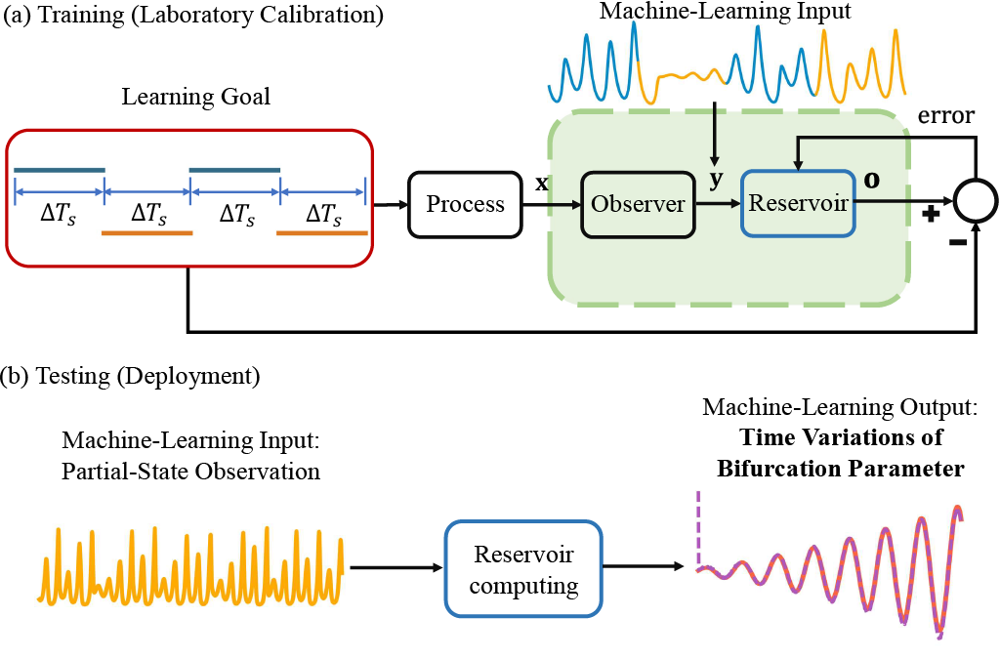
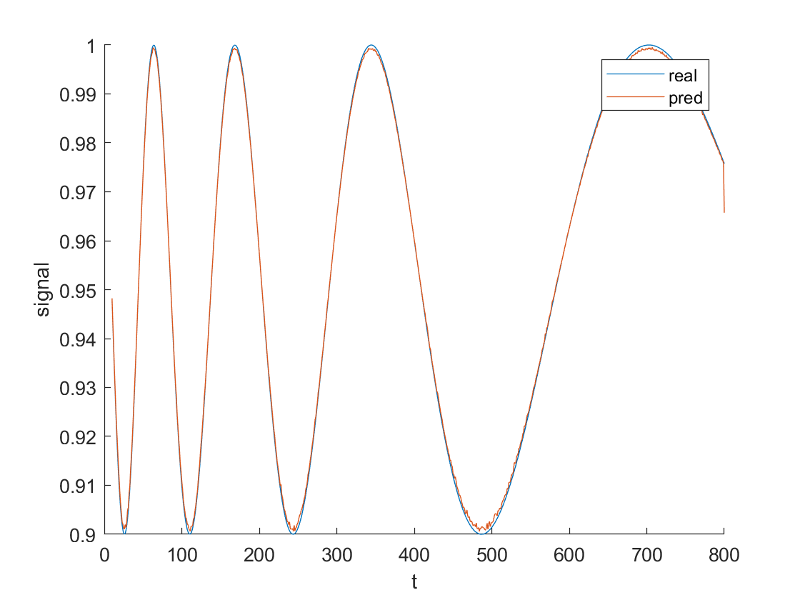

# Parameter Tracking with Machine Learning
Codes for ''Machine-learning parameter tracking with partial state observation'', a manuscript submitted to Physical Review Research.

# Description

Suppose we have a chaotic food-chain system of three species: resource, consumer, and predator, descirbed by the following set of nonlinear differential equations:

$\frac{d R}{dt} = {R(1-\frac{R}{\rm K}) - \frac{ {\rm x_c y_c} C R}{R+ {\rm R_0}}},$

$\frac{d C}{dt} = {\rm x_c} C (\frac{{\rm y_c} R}{R+{\rm R_0}}-1) - \frac{{\rm x_p y_p } P C}{C+{\rm C_0}} ,$

$\frac{d P}{dt} = {\rm x_p} P(\frac{ {\rm y_p} C}{C + {\rm C_0}}-1),$

where $R$, $C$, and $P$ are the population densities of the resource, consumer, and predator species, respectively. The system has seven parameters: $K, x_c, y_c, x_p, y_p, R_0, C_0 > 0$. The goal is to track the variations of a single parameter.

Here we proposed a machine-learning framework to achieve the goal with the following three main features: 

* Only the measurements from a partial set of the dynamical variables are needed, e.g., we only observe state $[R, C]$
* Observation of the state from a small number of parameter values suffices, i.e., we only require several constant parameter values in the training phase, 
* The historical parameter values are not required in real-time parameter tracking.

The details about training and testing phase are described in:

# Running Example
Run 'params_extraction.m' to get the ground truth and tracked paramter variations of parameter $K$ in the food chain system:

You may change 'system' to others to track parameters of different systems, e.g., system = 'mg';
