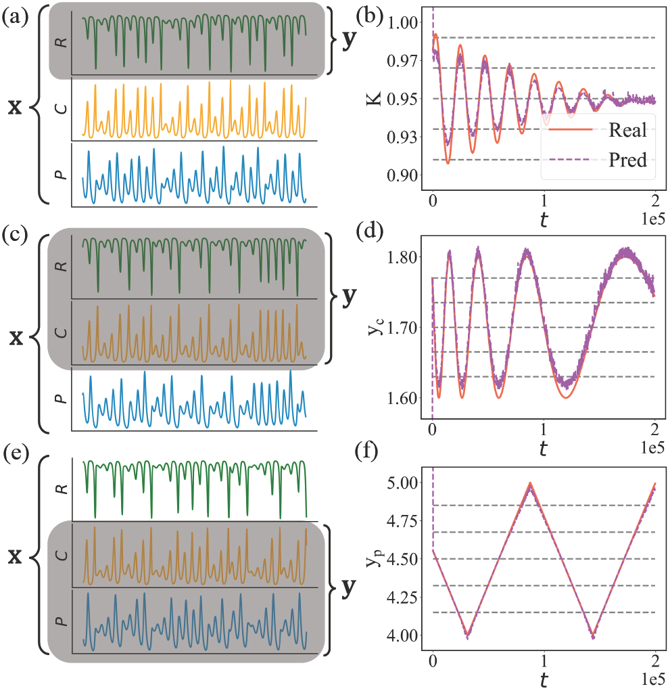

<h1 align="center">Machine-learning parameter tracking with partial state observation</h1>

<p align="center">

</p>

Reserovir computing based parameter tracking scheme. The goal is to track a parameter of the system from which only partial state observation is available.

The proposed machine-learning framework inlcudes the following three main features: 

* Only the measurements from a partial set of the dynamical variables are needed, e.g., we only observe state $[x_1]$ in a three dimensional system,
* Observation of the state from a small number of parameter values suffices, i.e., we only require several constant parameter values in the training phase, 
* The historical parameter values are not required in real-time parameter tracking.

Suppose we have a chaotic food-chain system of three species: resource, consumer, and predator, descirbed by the following set of nonlinear differential equations:

$\frac{d R}{dt} = {R(1-\frac{R}{\rm K}) - \frac{ {\rm x_c y_c} C R}{R+ {\rm R_0}}},$

$\frac{d C}{dt} = {\rm x_c} C (\frac{{\rm y_c} R}{R+{\rm R_0}}-1) - \frac{{\rm x_p y_p } P C}{C+{\rm C_0}} ,$

$\frac{d P}{dt} = {\rm x_p} P(\frac{ {\rm y_p} C}{C + {\rm C_0}}-1),$

where $R$, $C$, and $P$ are the population densities of the resource, consumer, and predator species, respectively. The system has seven parameters: $K, x_c, y_c, x_p, y_p, R_0, C_0 > 0$. The goal is to track the variations of a single parameter. We should examples in the following figure:

<p align="center">

</p>

Tracking time-varying parameters of the chaotic food-chain system. Different combinations of the parameter waveforms and partial
state observation are illustrated: the top, middle, and bottom row correspond to three types of parameter variations (AM, FM, and sawtooth
waveform), while the gray-shaded region in the left column illustrates the partial state observation. The right column gives the results of
parameter tracking in comparison with the ground truth.

# Running Example
Run 'params_extraction.m' to get the ground truth and tracked paramter variations of parameter $K$ in the food chain system:

<p align="center">

</p>

We offter the codes for four systems: a three-species chaotic food-chain system, the chaotic Rössler oscillator, the Mackey-Glass delay 
differential equation system, and the 40-dimensional Lorenz-96 system. You may change 'system' to others to track parameters of different systems, e.g., 'system = mg'.

You may change other commands, for example, set 'bi_paarams' as 2 when 'system' is foodchain to track the variations of the parameter, $y_c$ ; or set 'test_curve = linear' to track sawtooth waveform.

# Citation
This paper has been published at Physical Review Research: [https://journals.aps.org/prresearch/abstract/10.1103/PhysRevResearch.6.013196](https://journals.aps.org/prresearch/abstract/10.1103/PhysRevResearch.6.013196), and can be cited with the followling bibtex entry:
```
@article{PhysRevResearch.6.013196,
  title = {Machine-learning parameter tracking with partial state observation},
  author = {Zhai, Zheng-Meng and Moradi, Mohammadamin and Glaz, Bryan and Haile, Mulugeta and Lai, Ying-Cheng},
  journal = {Phys. Rev. Res.},
  volume = {6},
  issue = {1},
  pages = {013196},
  numpages = {19},
  year = {2024},
  month = {Feb},
  publisher = {American Physical Society},
  doi = {10.1103/PhysRevResearch.6.013196},
  url = {https://link.aps.org/doi/10.1103/PhysRevResearch.6.013196}
}
```
